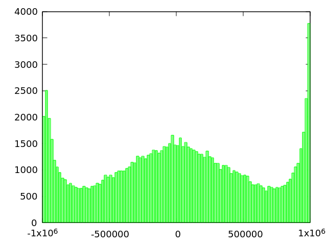
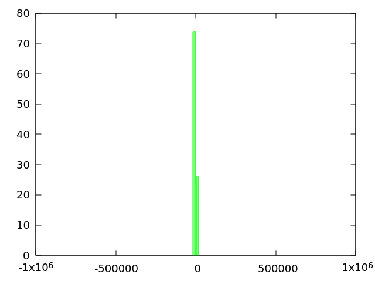

Part 4: Finally some code
--------------------

### Code results

#### C/pthreads

The *C* code:

```c
#include <pthread.h>
#include <stdio.h>

int i = 0;

// Note the return type: void*
void* incrementingThreadFunction(){
    for(int j=0;j<1000000;j++) i++;
    return NULL;
}

void* decrementingThreadFunction(){
    for(int j=0;j<1000000;j++) i--;
    return NULL;
}

int main(){
    pthread_t incrementingThread;
    pthread_t decrementingThread;
    pthread_create(&incrementingThread, NULL, incrementingThreadFunction, NULL);
    pthread_create(&decrementingThread, NULL, decrementingThreadFunction, NULL);
    
    pthread_join(incrementingThread, NULL);
    pthread_join(decrementingThread, NULL);
    
    //printf("The magic number is: %d\n", i);
    printf("%d\n", i);
    return 0;
}
```

The code is compiled with `make` using the`clang` compiler (for no apparent reason over `gcc` :) ). The program is then executed for 100000 runs. The resulting numbers `i` are then graphed in a histogram using *gnuplot*:

```
for i in {1..100000}; do ./foo >> a.txt; done; && gnuplot -p gnuplotcmds
```

```
n=100 #number of intervals
max=1000000. #max value
min=-1000000. #min value
width=(max-min)/n #interval width
#function used to map a value to the intervals
hist(x,width)=width*floor(x/width)+width/2.0
set boxwidth width*0.9
set style fill solid 0.5 # fill style

#count and plot
plot "a.txt" u (hist($1,width)):(1.0) smooth freq w boxes lc rgb"green" notitle

```


Histogram (sample size=100000):




The plot shows the random nature of the variable outcome.

#### Python

Python code:

```python
# Python 3.3.3 and 2.7.6
# python fo.py

from threading import Thread

# Potentially useful thing:
#   In Python you "import" a global variable, instead of "export"ing it when you declare it
#   (This is probably an effort to make you feel bad about typing the word "global")
i = 0

def incrementingFunction():
	global i
	for _ in range(1000000): #0..999999
		i=i+1

def decrementingFunction():
	global i
	for _ in range(1000000): #0..999999
		i=i-1

def main():
	# TODO: Something is missing here (needed to print i)
	global i

	incrementing = Thread(target = incrementingFunction, args = (),)
	decrementing = Thread(target = decrementingFunction, args = (),)
	
	# TODO: Start both threads
	incrementing.start()
	decrementing.start()
	
	incrementing.join()
	decrementing.join()
	
	print("The magic number is %d" % (i))

main()
```


#### Go

*Go* code:

```go
// Use `go run foo.go` to run your program

package main

import (
    . "fmt"
    "runtime"
    "time"
)

var i = 0

func incrementing() {
    for j := 0; j < 1000000; j++ {
		i++
	}
}

func decrementing() {
    for j := 0; j < 1000000; j++ {
		i--
	}
}

func main() {
    runtime.GOMAXPROCS(runtime.NumCPU())    // I guess this is a hint to what GOMAXPROCS does...
	                                        // Try doing the exercise both with and without it!

    // TODO: Spawn both functions as goroutines
    
    go incrementing()
    go decrementing()
    
    // We have no way to wait for the completion of a goroutine (without additional syncronization of some sort)
    // We'll come back to using channels in Exercise 2. For now: Sleep.
    time.Sleep(100*time.Millisecond)
    Println("The magic number is:", i)
}
```


### Explanation

In all three cases, there are two threads/coroutines accessing a common shared variable. As both threads are competing about increasing/decreasing the value, the final value of `i`is a random number in the interval -1e6 to +1e6.

I assume, die scheduler switching time is slow compared to the execution time of one for loop run. If the value of `i` is greatly reduced or increased from its starting value of zero than depends highly on which thread is the first to execute, which is assume to be a random one. Thats why the net value of `i`is not zero.

By artificially slowing down the for loops (adding 'NoOP' waiting loops), the previous statement is proven to be plausible. The variance of the final values of `i` is much smaller, i.e. the histogram is concentrated around zero.

Used code:

```c
//...
void* incrementingThreadFunction(){
    for(int j=0;j<1000000;j++) 
    {
		i++;
		for(int k=0;k<10000;k++); //slow down loop
	}
    return NULL;
}

void* decrementingThreadFunction(){
    for(int j=0;j<1000000;j++)
    {
		i--;
		for(int k=0;k<10000;k++); //slow down loop
	}
    return NULL;
}
//...
```


Histogram (sample size=100):

